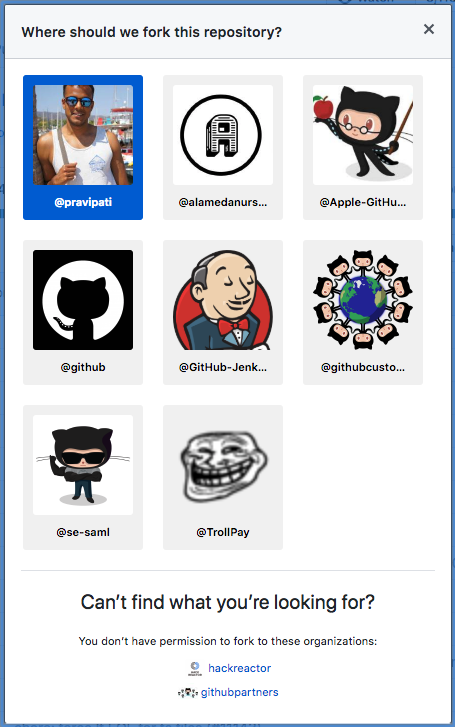
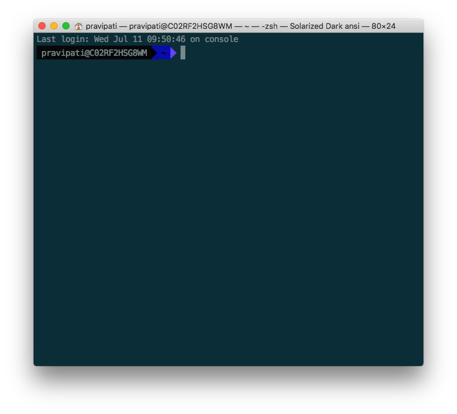
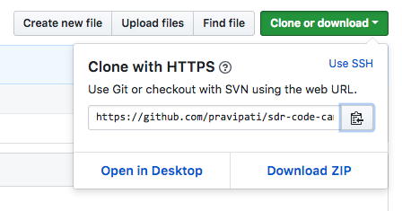
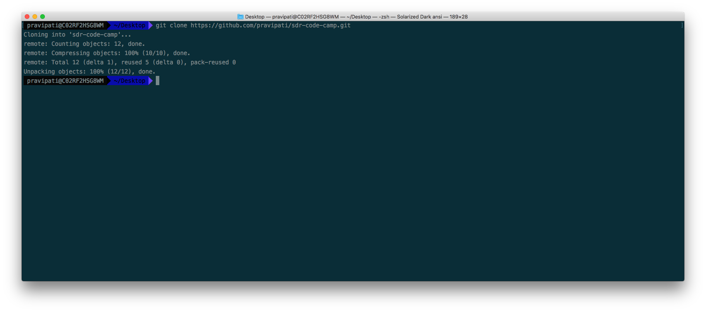
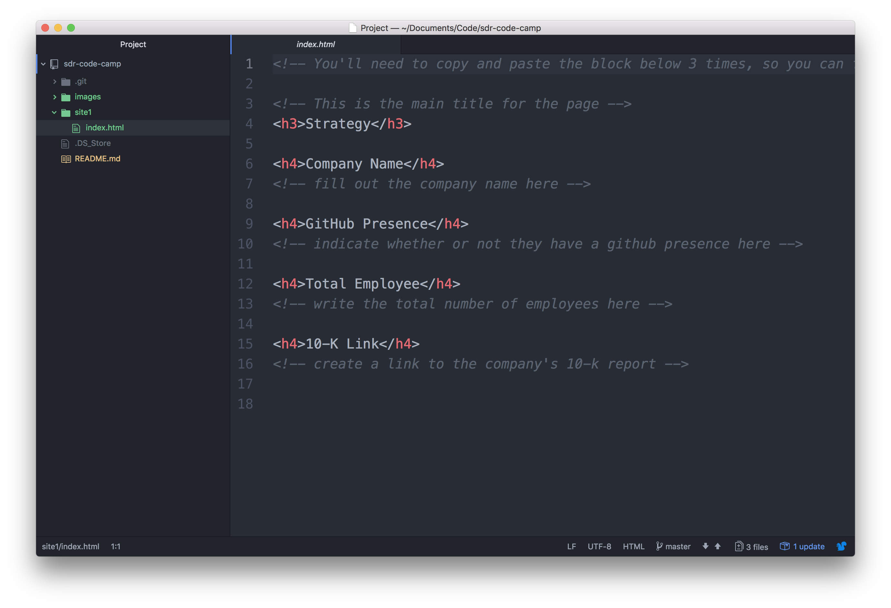
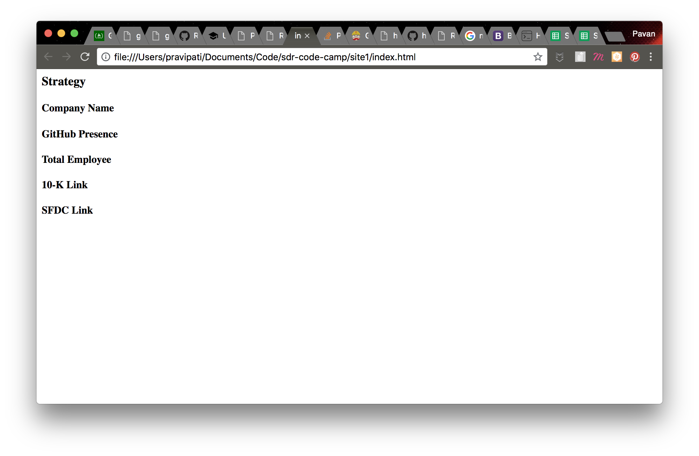

# sdr-code-camp
learn you some code!

## Build and deploy a website

### Setup

Before you can begin, make sure you go download the following:

* [GitHub Desktop](https://desktop.github.com/)
* [Atom IDE](https://ide.atom.io/)

Once you’ve done that, you’ll need to fork the [sdr-code-camp](https://github.com/pravipati/sdr-code-camp) repo. Be sure to fork it under your username!



### Getting to know your Terminal

Great! You’re all set up now. 



Have you seen this before? If not have no fear! It’s just your friendly computer terminal. 

> Peeling back the onion: most of the time when you use your computer, you’re clicking around on different menus, icons, or applications; all of these are a part of the GUI, or the _graphical user interface_. The terminal has what is known as a CLI, or a _command-line interface_. There’s tradeoffs with using either interface—the GUI makes it really easy to run a bunch of different tasks in parallel and, generally speaking, keeps you within the confines of how a particular application was designed. Conversely, a CLI is trickier when it comes to running multiple tasks at the same time, but you can re-imagine how apps function  and customize the inputs or outputs to suite your specific needs. A great analogy for GUI vs. CLI would be automatic vs. manual mode on a camera. A good amount of the time automatic mode will help you get a decent photograph and while it’s very rare that you will get a totally unusable photo, you often might find that the final photo didn’t match what you were going for. With manual mode, there’s more of a learning curve so in the beginning your photo quality will suffer. With a little practice though, you’ll be able to take pictures that truly surpass what you were able to do with full Auto. 

To find your terminal, hold the `⌘` button and press your spacebar. Once the spotlight search comes up, type in `Terminal` and press `Enter`.

Great! Now you have access to your Terminal’s prompt. At this point you can run commands in your terminal to do things.

**Definition**: **Commands**: A command is an instruction given by a user telling a computer to do something, such as run a single program or a group of linked programs. 

> Protip: if you’re curious to learn more about what a command in this tutorial means, type in `man [COMMAND]` swapping about `[COMMAND]` with the name of the command you want to learn more, i.e. `man ls`. The terminal will take you into the manual page for that command which you can scroll through using `j` and `k`. Once you’re done, type `q`. 

#### Command Cheat Sheet

**Core Commands**

| Command | Description|
|---------|-------------|
| cd | Home directory |
| cd [folder] | Change directory |
| cd ~ | Home directory, e.g. 'cd ~/folder/' |
| cd / | Root of drive |
| ls | Short listing |
| ls -l | Long listing |
| ls -a | Listing incl. hidden files |
| ls -lh | Long listing with Human readable file sizes |
| ls -R | Entire content of folder recursively |
| sudo [command] | Run command with the security privileges of the superuser (Super User DO) |
| open [file] | Opens a file |
| open . | Opens the directory |
| top | Displays active processes. Press q to quit |
| nano [file] | Opens the Terminal it's editor |
| pico  [file] | Opens the Terminal it's editor |
| q | Exit |
| clear | Clear screen |

**File Management**

| Command | Description|
|---------|-------------|
| touch [file] | Create new file |
| pwd | Full path to working directory |
| .. | Parent/enclosing directory, e.g. |
| ls -l .. | Long listing of parent directory |
| cd ../../ | Move 2 levels up |
| . | Current folder |
| cat | Concatenate to screen |
| rm [file] | Remove a file, e.g. rm [file] [file] |
| rm -i [file] | Remove with confirmation |
| rm -r [dir] | Remove a directory and contents |
| rm -f [file] | Force removal without confirmation |
| rm -i [file] | Will display prompt before |
| cp [file] [newfile] | Copy file to file |
| cp [file] [dir] | Copy file to directory |
| mv [file] [new filename] | Move/Rename, e.g. mv -v [file] [dir] |

**Directory Management**

| Command | Description|
|---------|-------------|
| mkdir [dir] | Create new directory |
| mkdir -p [dir]/[dir] | Create nested directories |
| rmdir [dir] | Remove directory ( only operates on empty directories ) |
| rm -R [dir] | Remove directory and contents |

Got all that? Great! Let’s build something now.

Type in `cd ~/Desktop`. This will take you to the Desktop of your computer. If you type in `ls` you can get of everything on your Desktop (if there is anything there). 

Now that we’re there, let’s go ahead and clone the repository we forked locally to our computer. Go to the repository you forked in GitHub and click on the “Clone or Download” button to grab the clone link. _Note_: be sure that you click on “Use HTTPS”.



Next, you’ll need to run the `git clone` command and paste the link as such:



You should now have a folder titled `sdr-code-camp` on your Desktop. You could find it on your Desktop via your GUI but since we’re already in the CLI…try running `ls`. Depending on what’s in `~/Desktop` you may see several different things or you may just have the `sdr-code-camp` folder. If you have a lot of stuff on your Desktop (we’ve all been there) try running `ls | grep sdr`. Now you should be able to see that the `sdr-code-camp` folder does in fact live on your Desktop. For the curious: run `man grep` and ask me what `|` does.

### Opening your code in Atom

Now that our code is in place (on our desktops) we can begin to interact with it and modify the existing codebase. In theory we just could use Notepad or any plain ol' text editor...so why bother with learning an entire new text editor? Well, the reasons are: 1) it's fun! 2) as you grow your skill level in programming, you'll find that any good text editor includes tools to help a developer with their day-to-day programming tasks. That's why text editors built for programmers are commonly known as _Integrated Development Environments_. It's also one of the reasons that choosing an IDE is such a personal event. 

Make sure that you're in the root directory for `sdr-code-camp` and run `atom .`. You should see:



Use the menu on the left hand side to navigate around different files. The first file we're working with is the `index.html` file inside of the `site1` folder. Click on that file and you'll notice one of the first benefits of using an IDE: syntax highlighting. Atom is smart enough to recognize the language that you're programming in and highlights its syntax to make reading and checking for syntax errors a little bit easier. 

_Why `index.html`?_: this is just a convention—historically the root website that you want to show people is titled `index.html`

### What you're going to build

You can really experiment with that you build for your website. Inside of the codebase, you'll find a template for adding information about 3 of your top targets, as well as some areas where you can add your strategy for how you will approach those top targets. Here's what it looks like at first:



While the template already has a structure in place, feel free to add or subtract more detail by adding or subtracting more HTML elements. Here's a cheat sheet of other elements you can add, but remember, Google is also your friend. 

> Peeling the Onion: what exactly is HTML? HTML is more of a markup language that you can use to describe the structure of a "web document", or a page that you'd like to share over the web, to someone who is using a browser or other html-reader to view your document. For more information, check out the [HTML wiki page](https://en.wikipedia.org/wiki/HTML)

When you're at a point where you'd like to see what your website looks like, go back to your terminal and type `open -a 'Google Chrome' site1/index.html`. As you make changes to your index.html page, you can just refresh your Chrome browser to see the updates in real time. 


### HTML Cheat Sheet

> Challenge: try adding a list, whether that is an `<ol>` or `<ul>` 

#### Headings
```html
<h1>Main heading</h1>
<!-- etc -->
<h6>Level-6 heading</h6>
```

tag | element
--- | ---
**h1** | main heading
**h6** | least important heading

#### Paragraphs
```html
<p>Paragraph.<br/>
Other line.</p>
<p>Other paragraph.</p>
<hr/>
<p>See the line above.</p>
```

tag | element
--- | ---
**p** | paragraph
**br** | line break
**hr** | horizontal line

#### Formatting
```html
<em>Formatting</em> is <strong>important</strong> !
(a+b)<sup>2</sup> = a<sup>2</sup> + b<sup>2</sup> + 2ab
```

tag | element
--- | ---
**sub** | subscript
**sup** | superscript
**em** | emphasize
**strong** | important
**mark** | highlighted
**small** | small
**i** | italic
**b** | bold

#### Links
```html
<a href="url">link</a>
<a href="url" target=_blank>open in a new window</a>

<a href="#comments">watch comments</a>
<h2 id="comments">comments</h2>
```

tag | element
--- | ---
**a** | hyperlink

#### Images
```html

```

tag | element
--- | ---
**img** | image

#### Blocks
```html
<div>block</div>
<span>inline</span>
```

tag | element
--- | ---
**div** | block-level element
**span** | inline element


#### Unordered list
```html
<ul>
    <li>item</li>
    <li>item</li>
    <li>item</li>
</ul>
```

tag | element
--- | ---
**ul** | unordered list
**li** | list item

#### Ordered list
```html
<ol>
    <li>first</li>
    <li>second</li>
    <li>third</li>
</ol>
```

tag | element
--- | ---
**ol** | ordered list
**li** | list item


### Making it all look good :sunglasses:

Hopefully you're happy with the structure of your site at this point. Now we can have some fun with styling it. The way that we're going to style our page is by using CSS. 

**Definition**: Cascading Style Sheets (CSS) is a style sheet language used for describing the presentation of a document written in a markup language like HTML.

In atom, click into the `site2` folder and open up the `index.html` file there. Notice that there are a few new elements including `<head>`, `<body>`, and `<style>`. For now the `<style>` tag is the one we will focus on. You'll also notice that there is the following within the `<style>` tags:

```
  * {
      /*these properties affect every element on your page*/
    }

    h3 {

    }

    p {

    }

    div {

    }
```

This is what the CSS language looks like. Each pair of an element and the curly brackets is what is known as a CSS rule-set. CSS rule-sets consists of a selector and a declaration block: The selector points to the HTML element you want to style. The declaration block contains one or more declarations separated by semicolons. Each declaration includes a CSS property name and a value, separated by a colon.


First things first, let's get rid of `Times New Roman` and use something a little more modern. While I'm at it, I'd like the title of my page to a different color. I'm a a big fan of `Arial` and Red—here's how we would set that up:

```
  * {
      /*these properties affect every element on your page*/
      font-family: Arial;
    }

    h3 {
      color: red;
    }

    p {

    }

    div {

    }
```


_Voila!_ look at that, we've just added some style to our page. 

Try playing with the background property of the different sections of your HTML page. Here's a little demo of how that works: [MSDN background property](https://developer.mozilla.org/en-US/docs/Web/CSS/background-color)


### Build it with Travis

With your new site built, it's time to show it to the rest of the world. As you continue to add more content and information to your site, you probably won't want to have to manually upload it to a host each time. This is where Travis can help.

Travis is is a CI/CD (continuous integration / continuous deployment) tool which we're going to use to deploy our code to GitHub Pages. W

https://docs.travis-ci.com/user/deployment/pages/

### Deploying it to a GitHub Page


### Extra for Experts

You made it this far :sparkles:! Let's venture a little further. Open up `site3/index.html` in Atom and give this tutorial a try:

[MSDN — First Splash into JS](https://developer.mozilla.org/en-US/docs/Learn/JavaScript/First_steps/A_first_splash)

Definitely raise your :hand: if you get this far and I'll come and help you get started. 